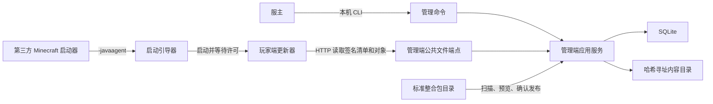
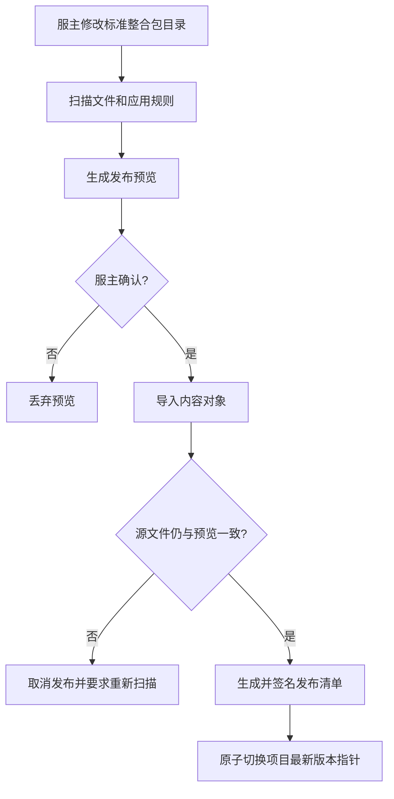
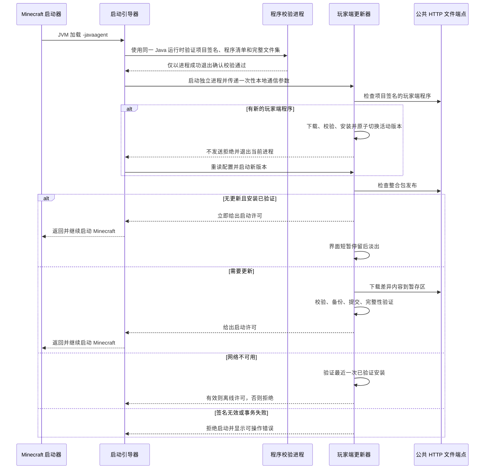

# DreamingFish Update System V1 设计

## 1. 产品边界

本系统让服主发布一套完整、可信的整合包目标状态，并在 Minecraft 启动前自动把玩家实例更新到该状态。

V1 包含三个程序：

1. **启动引导器**：Java 8 兼容的微型 Java Agent，运行在 Minecraft JVM 内，只负责启动玩家端更新器和等待启动许可。
2. **玩家端更新器**：独立的 JavaFX 桌面应用，负责检查、下载、事务安装、展示服务器信息和日志。
3. **管理端**：服主自托管的 Java 应用，提供完整 CLI、SQLite 元数据存储和公共 HTTP 文件服务。

V1 不负责账号登录、Minecraft 安装、实例管理、游戏启动、CDN、对象存储、HTTPS 终止、配置文件合并或反作弊。玩家自行添加的模组默认仅提示、保留且不阻止启动；项目可对选定的一级目录启用强制同步，将额外文件归档后再启动。黑名单和服务器准入推迟到后续版本。

## 2. 总体架构



V1 不开放网络管理接口。CLI 在管理机器本地直接调用应用服务；唯一监听端口是面向玩家的只读 HTTP 文件端点，因此远程管理应通过操作系统已有的 SSH 或远程终端完成。

## 3. 推荐技术栈

| 部分 | 选择 | 原因 |
| --- | --- | --- |
| 主语言 | Java | 用户可维护，且与 Minecraft 和 Java Agent 集成直接 |
| 构建 | Maven 多模块 + Maven Wrapper | 配置直观，便于初学 Java 的维护者复现构建 |
| 启动引导器 | Java 8 字节码 | 覆盖仍使用 Java 8 的游戏实例 |
| 玩家端与管理端 | 捆绑 Java 21 运行时 | 不依赖玩家或服务器预装 Java，使用现代标准库 |
| 玩家界面 | JavaFX + CSS | 可制作品牌化桌面界面，并保持 Java 技术栈统一 |
| CLI | picocli | 低开销、子命令和帮助信息成熟 |
| JSON | Jackson | 协议模型和严格解析成熟 |
| 数据库 | SQLite JDBC | 单机自托管、备份和部署简单 |
| HTTP | JDK 内置 `HttpServer` | 不引入 Web 框架运行时，适合资源有限的主机 |
| 哈希 | SHA-256 | 内容寻址和完整性校验 |
| 签名 | Ed25519 | 每项目独立签名身份，验证快且密钥较小 |

公共 HTTP 协议不依赖具体服务器实现，管理端当前直接使用 JDK 内置服务器。

## 4. 项目与发布模型

一个管理端实例可以管理多个相互独立的整合包项目。每个项目具有：

- 项目 ID、显示名称和说明；
- 一条发布线和严格递增的发布序号；
- 独立 Ed25519 密钥对；
- 一个标准整合包目录；该目录只需包含希望发布的内容，不要求复制完整游戏实例；
- 文件策略和排除规则；
- 可独立选择的一级强制同步目录；
- 品牌封面与服务器展示信息；
- 独立的玩家端项目绑定文件。

每个发布版本都是不可变的完整目标文件清单，不是依赖上一版本执行的补丁。内容按 SHA-256 存储，相同文件只保存一次；玩家比较本地内容后只下载缺少或不同的对象。

回滚不会修改历史版本，而是以历史目标状态创建一个更高发布序号的新版本。因此客户端可以拒绝低于本地已接受序号的重放响应，同时仍允许服主正常回滚。

### 文件策略

| 策略 | 发布新增 | 发布修改 | 发布删除 | 本地额外文件 |
| --- | --- | --- | --- | --- |
| 强制托管 | 写入 | 覆盖 | 删除 | 不相关 |
| 默认文件 | 仅本地不存在时写入 | 不覆盖 | 不删除 | 不相关 |
| 非托管/排除 | 不处理 | 不处理 | 不处理 | 保留 |
| 强制同步目录 | 写入 | 覆盖 | 归档旧文件 | 归档到玩家长期备份 |

标准整合包目录内未匹配特殊规则的文件默认是强制托管文件。目录可以只有 `mods/` 和 `config/`，此时其它玩家目录不在目标文件清单中，也不会被更新器修改。服主必须显式配置默认文件和排除项，发布预览显示最终策略、增删改列表与预计下载量。

强制同步只允许按标准整合包目录的一级文件夹配置，并递归覆盖其中所有文件类型。每个目录独立生效；例如只强制 `mods/` 时，`config/` 中的非托管文件仍然保留。配置的源目录缺失会使扫描和发布失败；服主必须保留一个显式空目录，才能发布“将该目录清空”的目标状态。

## 5. 管理端发布流程



发布不能由目录监听器自动触发。交互式 CLI 在发布前要求确认，自动化脚本必须显式使用 `--yes`。源目录在扫描或导入过程中变化会使预览失效，防止一个不可变发布混入两个时点的文件。

建议的 V1 CLI：

```text
dfs-admin init
dfs-admin project create
dfs-admin project configure
dfs-admin project scan <project>
dfs-admin project publish <project> [--yes]
dfs-admin project releases <project>
dfs-admin project rollback <project> <release>
dfs-admin project binding <project> --instance <instance> --platform <platform> --release <release>
dfs-admin player publish <project> --platform <platform> --version <version> ...
dfs-admin player list <project> --platform <platform>
dfs-admin serve
dfs-admin backup create
dfs-admin backup restore
```

CLI 调用独立的应用服务层，发布、签名和备份规则不写在命令解析代码中。V1 不包含 WebUI。

目录级强制同步可以用参数式 CLI 修改，便于在 SSH 或自动化终端中使用：

```text
dfs-admin project configure <project> --force-sync-directories mods,resourcepacks
dfs-admin project configure <project> --clear-force-sync
```

`--force-sync-directories` 替换完整列表，`--clear-force-sync` 清空列表；二者不能同时使用，配置变化必须进入新的不可变发布后才对玩家生效。

## 6. 公共 HTTP 协议

V1 使用只读 HTTP GET 接口，不需要玩家账号或 Cookie：

```text
GET /v1/projects/{projectId}/latest
GET /v1/projects/{projectId}/releases/{releaseId}/manifest
GET /v1/projects/{projectId}/player/{platform}/latest
GET /v1/projects/{projectId}/player/{platform}/versions/{version}/manifest
GET /v1/objects/sha256/{hash}
```

发布描述包含项目 ID、发布 ID、递增序号、创建时间、清单哈希、最低玩家端版本、更新说明、强制同步一级目录和签名。目标文件条目至少包含规范化相对路径、SHA-256、大小和文件策略。

签名覆盖服务器实际发送的确定性字节，不由客户端重新拼装 JSON 后验证。客户端先验证签名和项目身份，再信任其中的 URL、版本和哈希。路径必须是正斜杠相对路径，并拒绝绝对路径、`..`、设备名、大小写冲突和逃逸实例目录的符号链接。

清单具有明确的格式版本。未知可选字段可以忽略；未知必要能力、过低玩家端版本或非法字段必须安全失败。强制同步发布声明 `forced-directory-sync-v1` 必要能力，旧玩家端必须先自更新，不能静默忽略。HTTP 服务支持 `Range`、`ETag` 和合理缓存头，以便断点续传和重复对象复用，但 V1 不引入 CDN 配置。

## 7. 玩家端启动流程



启动许可与窗口寿命相互独立。Agent 收到许可后立即返回，JavaFX 窗口可以继续展示完成状态或淡出，不阻塞 Minecraft。

程序校验进程来自 Agent 自己所在的固定 JAR，使用 Minecraft 的同一 `java.home`，父 Agent 等待它的精确进程句柄；失败、超时或被中断都会阻止启动。这样避开部分 Java 8 在 `premain` 阶段执行大文件哈希时缺少正常 JIT 优化的性能问题，不引入可写的信任缓存。

Agent 与玩家端更新器通过仅监听回环地址的短生命周期通道通信，并携带随机一次性令牌。Agent 不解析整合包发布清单、不下载文件，也不加载 JavaFX。

## 8. 更新事务与并发

一次更新按以下顺序执行：

1. 获取实例更新锁，读取上次事务日志和已验证安装状态；首次运行时验证正式下载包携带的签名分发基线。
2. 获取并验证最新发布描述，拒绝低序号重放。
3. 必要时先安装并验证新的玩家端程序版本。
4. 扫描受托管文件与强制同步目录，计算下载、创建、替换、删除和长期归档计划。
5. 下载到暂存目录，支持续传，并逐个验证大小和 SHA-256。
6. 为即将替换、删除或归档的文件创建事务备份。
7. 按持久化事务日志提交文件变化；强制同步文件先进入事务暂存归档，整次更新成功后再提交到长期备份。
8. 完整验证目标状态，原子写入新的已验证安装记录。
9. 给出启动许可，再清理事务备份和无引用临时文件。

程序崩溃或断电后，下次启动根据事务日志继续校验或恢复原状态。签名错误、哈希错误、路径冲突、磁盘空间不足或无法完成回滚时都不能给出启动许可。

启动引导器在 Minecraft 存活期间持有实例运行标记。同一实例再次启动时：若没有待安装更新且当前安装已验证，可以继续；若存在更新，则提示先关闭运行中的游戏，绝不在游戏使用文件时修改实例。

## 9. 本地目录布局

首次分发的整合包实例包含稳定的引导文件：

```text
<游戏实例目录>/
  .dreamingfish-bootstrap/
    bootstrap-agent.jar
    project-binding.json
    project-cover                  # 项目设置封面时由绑定命令带入
    bundled-release/
      manifest.json                # 下载包对应的历史签名发布基线
      manifest.sig
  DreamingFishUpdater/             # 默认玩家端安装目录
    app/<程序版本>/
    cache/objects/sha256/
    logs/
    backups/forced-sync/<时间戳_发布ID>/
    local-mods/disabled/
    state/
      local-file-preferences.json
      local-mod-preferences.json
    staging/
```

玩家端安装目录由实例内签名信任边界之外的项目绑定固定指定，通常使用实例相对路径 `DreamingFishUpdater`。程序不在首次启动询问位置，也不自行迁移到系统目录；整合包移动后，相对路径会随实例一起生效。Agent 和项目绑定文件始终留在实例目录，因此不需要修改 PCL2、HMCL 或 Prism Launcher 的 JVM 参数。

玩家端安装目录以及 `.dreamingfish-bootstrap` 必须排除在普通整合包目标清单之外，由各自的升级和引导逻辑管理。

管理端制作每个正式下载包时必须显式选择该包对应的不可变发布。管理端验证已有同路径文件、从内容对象库补齐缺失文件，并写入签名分发基线；因此从任意旧正式包首次启动时，玩家端可以识别旧托管状态并直接收敛到最新发布，而不会把已从远程删除的旧官方模组误认为玩家自选模组。

## 10. 玩家端桌面界面

### 视觉方向

梦鱼服默认主题参考 `D:\Desktop\DreamingFishOfficialWebsite\public\dreamhaven\index.html` 的桌面封面：

- 使用全窗口、可辨认的服务器实景图作为背景，不放进卡片；
- 左侧使用高对比的大标题、短句和简洁服务器信息；
- 用左深右亮、底部加深的遮罩保证文字和进度可读，同时保留右侧景观主体；
- 延续暖白文字，并仅用青色、紫色和橙色作少量状态强调；
- 动效保持克制，包括轻微背景视差、状态切换和完成后的淡出；
- 顶部保留主页、新闻、守望梦屿和关于四个简洁栏目，并提供背景音乐开关。

桌面窗口初始尺寸为 `1180 x 680`，最小尺寸为 `960 x 560`。视觉验收只以参考网页的电脑端封面为准，不采用手机端主构图，也不在窄窗口中改成移动端纵向堆叠。窗口采用自定义但熟悉的最小化和关闭按钮，并保留键盘焦点、缩放和高 DPI 支持。

### 布局

```text
┌──────────────────────────────────────────────────────────────┐
│ DreamHaven 守望梦屿                         _  □  ×          │
│                                                              │
│                                                              │
│  灾变之后，仍有人在这里守望。                                │
│  欢迎回到                                                    │
│  梦屿                                                        │
│  服务器状态 / 当前版本 / 更新摘要                            │
│                                                              │
│                                      正在校验文件  68%        │
│                                      config/example.toml      │
│                                      ━━━━━━━━━━━━━━━╺━━━━     │
│                                      184 MB / 271 MB  查看日志│
└──────────────────────────────────────────────────────────────┘
```

右下角进度区不做独立大卡片，而是直接落在底部深色遮罩上。它固定宽度并包含：当前阶段、百分比、当前文件、已完成/总大小、水平进度条、展开日志按钮。阶段切换不能改变区域尺寸，避免界面跳动。

状态设计：

- **检查中**：显示不确定进度动画和当前检查项；
- **下载/安装中**：显示总进度与当前文件，关闭按钮先弹出中止确认；
- **无需更新**：立即发出启动许可，显示“已是最新版本”，约 1.5 至 3 秒后淡出；
- **完成**：先发出启动许可，再短暂停留展示版本和更新摘要；
- **离线许可**：使用明显但非错误式的离线标识，说明正在使用最近验证版本；
- **阻断错误**：停止自动关闭，展示原因、重试、打开日志和打开目录；
- **非托管模组**：以可展开提醒展示，不覆盖主进度，不阻止启动。
- **强制同步归档**：明确说明远程管理端启用的目录、移出数量和备份位置，并提供打开备份目录按钮。
- **本地文件**：普通同步下可豁免单个托管文件或整个目录，并可通过 Forge、NeoForge 与 Fabric 元数据只在本机停用模组；目录强制同步始终优先且禁用对应本地开关，停用模组前必须提示依赖和服务器连接风险。
- **历史与日志**：更新记录展示项目的全部历史发布，运行记录使用支持中文的虚拟列表；断网时使用本地历史缓存。

通用发行版允许每个项目提供项目名称、桌面封面图、短说明和有限主题色。推荐的 `project binding --instance` 会把管理端项目封面校验后带入实例；没有项目封面时，梦鱼服包使用内置 `hero-dreamhaven.png`。主题配置不允许注入 HTML、脚本或任意本地文件路径。

## 11. 管理端存储与备份

SQLite 保存项目、发布、文件条目、规则、对象引用、审计时间和密钥元数据。大文件以普通文件存储：

```text
data/
  management.db
  objects/sha256/ab/<完整哈希>
  manifests/<project>/<release>/
  keys/
  temp/
```

对象导入采用“临时文件、校验、同文件系统原子改名”，数据库只在对象就绪后提交引用。V1 保留不可变发布历史及其引用对象，不自动执行对象垃圾回收；这是有意的保守边界，避免在首版中误删仍需回滚或恢复的内容。

`backup create` 通过 SQLite 一致性快照生成加密归档，包含数据库、配置、项目私钥、签名清单和全部内容对象。密钥派生使用面向密码的内存困难算法，归档使用认证加密；恢复必须先完整验证归档，再替换目标数据。V1 默认完整备份，不做增量备份。

## 12. 建议代码结构

```text
pom.xml
bootstrap-agent/       Java 8 Agent、进程启动、许可通道
protocol/              清单模型、严格解析、签名与路径规则
update-engine/         差异计算、下载、事务、恢复、安装状态
player-app/            JavaFX、FXML、CSS、项目主题
management-core/       项目、扫描、发布、回滚、备份应用服务
management-cli/        完整 picocli 管理界面
packaging/             jpackage、Windows/Linux 分发脚本
```

公共 HTTP 文件端点位于 `management-core`，由 `management-cli serve` 启动。业务规则放在 `protocol`、`update-engine` 和 `management-core`，JavaFX、CLI、HTTP 只做输入输出适配，避免把发布或更新逻辑绑在界面中。

## 13. V1 实现状态

已实现：协议与签名、管理 CLI、扫描预览、不可变发布、只读 HTTP、事务更新与崩溃恢复、离线许可、Java 8 Agent、启动前玩家程序验证、玩家端自更新与失败回退、桌面 JavaFX 界面、完整加密备份、Windows/Linux 管理端打包。

明确延后：WebUI、黑名单和服务器准入、反作弊、CDN、对象自动垃圾回收、玩家端旧版本自动清理、程序内 HTTPS。延后项不是 V1 正常发布与更新闭环的依赖。

## 14. 验收底线

- 断网时只允许启动最近一次已验证安装；
- 对清单、对象或玩家端程序的任意一字节篡改都会被发现；
- Agent 在启动活动版本和回退版本前都重新验证项目签名及完整程序目录；
- 在下载、备份、替换和提交任一步强制终止进程，下次启动都能恢复或安全继续；
- 发布过程中修改源文件不会产生混合发布；
- Windows 路径大小写、保留名称、长路径和符号链接不能逃逸实例目录；
- 运行中的实例不会被更新；
- 普通目录中的额外模组只提示并保留；强制同步目录中的额外文件进入独立长期备份；
- 任意旧正式下载包都能凭签名分发基线直接更新到最新完整发布；
- 无更新时 Agent 尽快获得许可，JavaFX 窗口稍后自行淡出；
- 管理端在无图形环境的 Windows 和 Linux x64 上可完整操作；
- 从一份管理端备份可以在新机器恢复原项目身份和全部历史发布。
