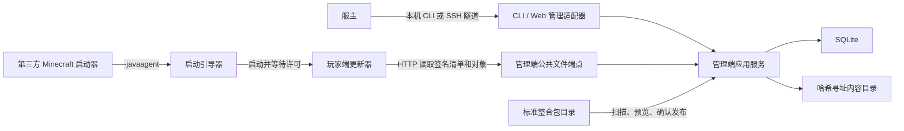
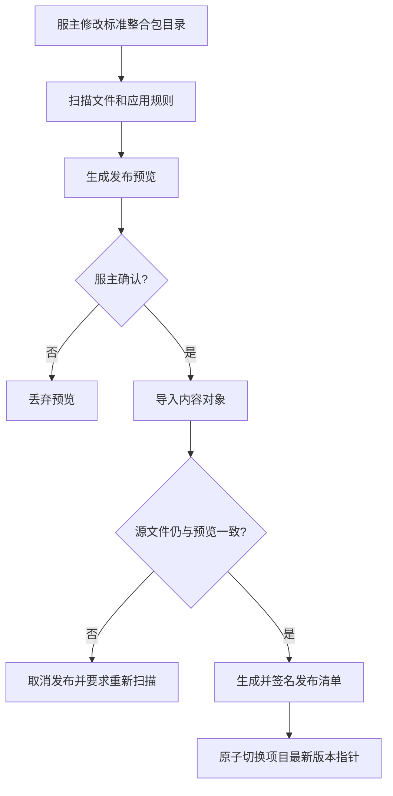
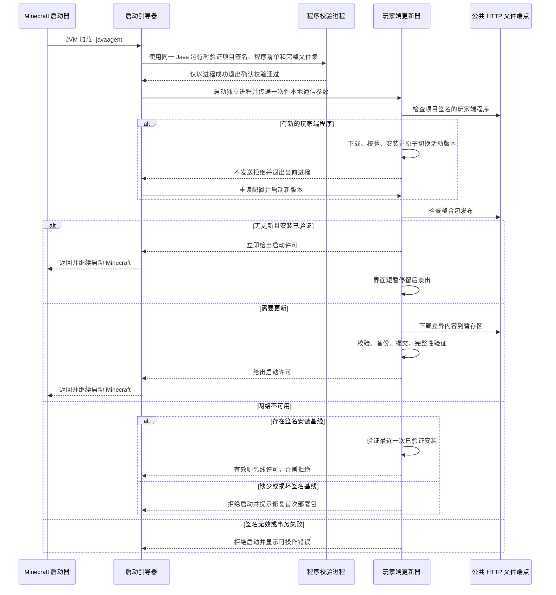

# DreamingFish Update System V1 设计

## 1. 产品边界

本系统让服主发布一套完整、可信的整合包目标状态，并在 Minecraft 启动前自动把玩家实例更新到该状态。

V1 包含三个程序：

1. **启动引导器**：Java 8 兼容的微型 Java Agent，运行在 Minecraft JVM 内，只负责启动玩家端更新器和等待启动许可。
2. **玩家端更新器**：Tauri + Vue 窗口与无界面的 Java 侧车，负责检查、下载、事务安装、展示服务器信息和日志。
3. **管理端**：服主自托管的 Java 应用，提供完整 CLI、本机 Web 管理界面、SQLite 元数据存储和公共 HTTP 文件服务。

V1 不负责账号登录、Minecraft 安装、实例管理、游戏启动、HTTPS 终止、通用配置文件合并或反作弊。它支持静态导出及 WebDAV、S3 兼容上传，外部存储权限、CDN 配置和证书由服主在对应服务中管理。普通同步目录中，玩家自行添加且不匹配持续移除或问题要求的模组仅提示并保留；强制目录中的额外文件先移入备份再启动。必要处理失败会阻止授予许可；通用模组黑名单和服务器准入推迟到后续版本。

## 2. 总体架构


```mermaid
flowchart LR
    L["第三方 Minecraft 启动器"] -->|"-javaagent"| A["启动引导器"]
    A -->|"启动并等待许可"| U["玩家端更新器"]
    U -->|"HTTP 读取签名清单和对象"| H["管理端公共文件端点"]
    M["服主"] -->|"本机 CLI 或 SSH 隧道"| C["CLI / Web 管理适配器"]
    C --> S["管理端应用服务"]
    H --> S
    S --> D["SQLite"]
    S --> O["哈希寻址内容目录"]
    P["标准整合包目录"] -->|"扫描、预览、确认发布"| S
```

管理接口与玩家下载接口使用独立监听器。Web 管理端默认监听 `127.0.0.1`，远程管理推荐通过 SSH 隧道访问；开放远程 Web 登录时使用管理账户和外部 TLS 反向代理。面向玩家的只读 HTTP 文件端点可监听公网网卡。CLI 和 Web 都直接调用同一应用服务。

## 3. 推荐技术栈

| 部分 | 选择 | 原因 |
| --- | --- | --- |
| 主语言 | Java | 用户可维护，且与 Minecraft 和 Java Agent 集成直接 |
| 构建 | Maven 多模块 + Maven Wrapper | 配置直观，便于初学 Java 的维护者复现构建 |
| 启动引导器 | Java 8 字节码 | 覆盖仍使用 Java 8 的游戏实例 |
| 玩家端与管理端 | 捆绑 Java 21 运行时 | 不依赖玩家或服务器预装 Java，使用现代标准库 |
| 玩家界面 | Tauri 2 + Vue 3 + TypeScript | 使用系统 WebView 渲染品牌化桌面界面，Java 侧车只负责更新业务 |
| CLI | picocli | 低开销、子命令和帮助信息成熟 |
| JSON | Jackson | 协议模型和严格解析成熟 |
| 数据库 | SQLite JDBC | 单机自托管、备份和部署简单 |
| HTTP | JDK 内置 `HttpServer` | 不引入 Web 框架运行时，适合资源有限的主机 |
| 哈希 | SHA-256 | 内容寻址和完整性校验 |
| 签名 | Ed25519 | 每项目独立签名身份，验证快且密钥较小 |

公共 HTTP 协议不依赖具体服务器实现，管理端当前直接使用 JDK 内置服务器。

## 4. 项目与发布模型

一个管理端实例可以管理多个相互独立的整合包项目。每个项目具有：

- 项目 ID、显示名称和说明；
- 一条发布线和严格递增的发布序号；
- 独立 Ed25519 密钥对；
- 一个标准整合包目录；该目录只需包含希望发布的内容，不要求复制完整游戏实例；
- 排除规则，以及按文件或文件夹设置的维护方式；
- 强制同步目录及其额外文件归档要求；
- 可选内容分组，以及持续生效的问题版本撤回和玩家文件修正；
- 品牌封面与服务器展示信息；
- 独立的玩家端项目绑定文件。

每个发布版本都是不可变的完整目标文件清单，不是依赖上一版本执行的补丁。内容按 SHA-256 存储，相同文件只保存一次；玩家比较本地内容后只下载缺少或不同的对象。

回滚不会修改历史版本，而是以历史目标状态创建一个更高发布序号的新版本。因此客户端可以拒绝低于本地已接受序号的重放响应，同时仍允许服主正常回滚。回滚继承当前累计的已释放路径；只有目标重新托管同一路径或明确镜像该范围时，才移除对应释放声明。

### 文件维护方式

0.2.0 起，管理界面只提供普通同步、强制同步和首次提供。旧签名发布继续按其原规则解释；新发布声明 `maintenance-policy-v2` 和 `simplified-maintenance-v1`，最低玩家端为 0.2.0。

| 方式 | 日常处理 | 玩家操作 |
| --- | --- | --- |
| 普通同步 | 缺失补齐、跟随发布，修改过的替换前备份 | 可以停用或自行管理 |
| 强制同步 | 必须与发布内容一致 | 不能豁免；目录范围同时移出额外文件 |
| 首次提供 | 已有文件保留，缺失时提供一次；之后不覆盖、不补回 | 可以自行维护，也可以主动恢复当前默认文件 |

默认配置不再作为新设置的第四种方式，旧设置转换成首次提供；旧签名中的 `DEFAULT_CONFIG` 和更早的 `DEFAULT` 保留原语义。可选内容只组织普通同步的资源，强制目录不再自动降级可选模组，也不允许首次提供等例外。

文件移除只提供两个选择：移除玩家副本（默认）和停止维护、留给玩家。前者形成持续移除要求，活动、停用、豁免或首次提供副本都先备份再移出；重新装回仍会处理。后者交还副本，后续不再主动下发或日常管理。强制目录内不能保留额外副本，需要先放宽目录设置。

新目标是完整状态。客户端不再依据上一安装清单推断删除，持续移除由最新签名目标明确声明。模组按内容和组件身份盘点，包括历史发行路径；普通文件按原路径处理。重新提供同一资源会结束普通持续移除，历史问题版本的要求仍需明确结束。回滚保留现行问题处理；目标包含仍被处理的版本时拒绝发布。

问题处理只有一个入口：选历史问题版本后移出，或换成本次准备的正确文件。所有玩家各重置一次放在更多替换选项内。当前标准目录仍含选中坏版本时，会校验内容并先归档源副本，再准备同一份发布；更新后的正确替代文件不会因旧版本选择被移除。

首次检查旧项目会将已删除、未交还玩家的历史托管资源迁移为待发布的持续要求，显示在预览中；取消后不会再次自动生成。没有已发布目标的资源不凭文件名推测身份。

启动许可以完成取得的可信目标为条件。离线可以用本机内容完成已知移除；不能借“保留本地变更”绕过已知问题处理。尚未取得的新发布不能在离线时获知，已经运行的游戏也不会自动卸载模组。

## 5. 管理端发布流程


```mermaid
flowchart TD
    E["服主修改标准整合包目录"] --> S["扫描文件和应用规则"]
    S --> P["生成发布预览"]
    P --> Q{"服主确认?"}
    Q -->|"否"| X["丢弃预览"]
    Q -->|"是"| I["导入内容对象"]
    I --> V{"源文件仍与预览一致?"}
    V -->|"否"| F["取消发布并要求重新扫描"]
    V -->|"是"| G["生成并签名发布清单"]
    G --> C["原子切换项目最新版本指针"]
```

发布不能由目录监听器自动触发。交互式 CLI 在发布前要求确认，自动化脚本必须显式使用 `--yes`。源目录在扫描或导入过程中变化会使预览失效，防止一个不可变发布混入两个时点的文件。

预览同时冻结项目配置摘要、同步规则和移除决定；确认绑定预览标识及整份预览摘要。配置、移除决定或扫描预览变化后，旧确认被拒绝。CLI、Web 和扫描服务使用项目操作锁；旧版持久化预览需要重新扫描，不影响已签名发布和玩家安装基线。

建议的 V1 CLI：

```text
dfs-admin init
dfs-admin project create
dfs-admin project configure
dfs-admin project scan <project>
dfs-admin project publish <project> [--yes]
dfs-admin project releases <project>
dfs-admin project rollback <project> <release>
dfs-admin project binding <project> --instance <instance> --platform <platform> --release <release>
dfs-admin player publish <project> --platform <platform> --version <version> ...
dfs-admin player list <project> --platform <platform>
dfs-admin serve
dfs-admin backup create
dfs-admin backup restore
```

CLI 与 WebUI 调用同一应用服务层，发布、签名和备份规则不写在命令解析或 HTTP 处理代码中。WebUI 覆盖日常发布流程，加密备份与恢复只保留在 CLI。

维护规则可以用参数式 CLI 修改，便于在 SSH 或自动化终端中使用，与 Web 管理界面的“管理内容”页面等价：

```text
dfs-admin project policy show <project>
dfs-admin project policy preset <project> config INITIAL --directory
dfs-admin project policy preset <project> mods REQUIRED --directory
dfs-admin project policy group <project> --title 光影与美化 --default-off
dfs-admin project policy group-members <project> <group> --add mods/iris.jar
dfs-admin project policy history <project> [路径关键字]
dfs-admin project policy withdraw <project> mods/a.jar=<内容标识前缀> --reason "..."
dfs-admin project policy correct <project> config/a.toml --mode KNOWN_BAD --bad <前缀> --reason "..."
```

旧参数 `--force-sync-directories`、`--force-sync-files` 与 `project policy cleanup` 仍作为强制同步的兼容入口。所有规则变化都必须进入新的不可变发布后才对玩家生效；新规则发布需要玩家端 0.2.0 或更新版本，项目还没有发布这样的玩家端时，`project publish` 与 `project rollback` 需要 `--confirm-player-upgrade`。

## 6. 公共 HTTP 协议

V1 使用只读 HTTP GET 接口，不需要玩家账号或 Cookie：

```text
GET /v1/projects/{projectId}/latest
GET /v1/projects/{projectId}/releases/{releaseId}/manifest
GET /v1/projects/{projectId}/player/{platform}/latest
GET /v1/projects/{projectId}/player/{platform}/versions/{version}/manifest
GET /v1/objects/sha256/{hash}
```

发布描述包含项目 ID、发布 ID、递增序号、创建时间、清单哈希、最低玩家端版本、更新说明、强制目录的额外文件清理要求、可选内容分组、已释放路径、持续移除与问题处理指令和签名。旧发布中独立清理、保留自行管理副本、目录与单文件强制同步等字段继续兼容。目标文件条目至少包含规范化相对路径、SHA-256、大小、维护方式，以及可选的模组 ID、版本和可选内容分组。

签名覆盖服务器实际发送的确定性字节，不由客户端重新拼装 JSON 后验证。客户端先验证签名和项目身份，再信任其中的 URL、版本和哈希。路径必须是正斜杠相对路径，并拒绝绝对路径、`..`、设备名、大小写冲突、符号链接和 Windows 目录联接。路径检查包含现有父目录与根目录；创建目录和实际文件操作前重新验证。

内置文件服务在同一响应中使用 `X-Dfs-Signature`。静态导出同时生成 `latest.signed`、`presentation.signed` 和各玩家平台的 `latest.signed`：文件格式为 `DFS-SIGNED-1` 换行、Base64 签名换行、未经重编码的原始载荷字节。没有签名响应头时，玩家端使用这个单文件载荷，避免分别读取可变清单和签名造成混合版本。只有 `.signed` 返回 404 时才兼容旧 `.sig` 目录；已存在但损坏的 `.signed` 或签名头不会降级。`.signed` 与对象、历史清单一并上传，可变 `.signed` 使用短缓存或重新验证。

HTTP 请求在连接和响应头阶段可取消，响应体的单次阻塞读取也有期限；默认整合包请求为 30 秒，个性化内容为 8 秒。取消会关闭活动响应流，下载器等待所有工作线程退出后才返回，后续重试不能与前次写入并发操作暂存文件。大文件只要持续传输，不受一个总计 30 秒的响应体上限限制。

清单具有明确的格式版本。未知可选字段可以忽略；未知必要能力、过低玩家端版本或非法字段必须安全失败。新完整目标声明 `simplified-maintenance-v1` 与 `maintenance-policy-v2`，显式携带持续移除，不依靠旧安装清单推断退场；放弃管理声明 `released-paths-v1`。旧发布的目录与单文件强制同步分别为 `forced-directory-sync-v1`、`forced-file-sync-v1`。旧玩家端必须先自更新到 0.2.0，不能静默忽略新要求。HTTP 服务支持 `Range`、`ETag` 和合理缓存头，以便断点续传和重复对象复用，但 V1 不引入 CDN 配置。

## 7. 玩家端启动流程


```mermaid
sequenceDiagram
    participant L as Minecraft 启动器
    participant A as 启动引导器
    participant V as 程序校验进程
    participant U as 玩家端更新器
    participant H as 公共 HTTP 文件端点

    L->>A: JVM 加载 -javaagent
    A->>V: 使用同一 Java 运行时验证项目签名、程序清单和完整文件集
    V-->>A: 仅以进程成功退出确认校验通过
    A->>U: 启动独立进程并传递一次性本地通信参数
    U->>H: 检查项目签名的玩家端程序
    alt 有新的玩家端程序
        U->>U: 下载、校验、安装并原子切换活动版本
        U-->>A: 不发送拒绝并退出当前进程
        A->>U: 重读配置并启动新版本
    end
    U->>H: 检查整合包发布
    alt 无更新且安装已验证
        U-->>A: 立即给出启动许可
        A-->>L: 返回并继续启动 Minecraft
        U->>U: 界面短暂停留后淡出
    else 需要更新
        U->>H: 下载差异内容到暂存区
        U->>U: 校验、备份、提交、完整性验证
        U-->>A: 给出启动许可
        A-->>L: 返回并继续启动 Minecraft
    else 网络不可用
        alt 存在签名安装基线
            U->>U: 验证最近一次已验证安装
            U-->>A: 有效则离线许可，否则拒绝
        else 缺少或损坏签名基线
            U-->>A: 拒绝启动并提示修复首次部署包
        end
    else 签名无效或事务失败
        U-->>A: 拒绝启动并显示可操作错误
    end
```

启动许可与窗口寿命相互独立。Agent 收到许可后立即返回，Tauri 窗口可以继续展示完成状态或淡出，不阻塞 Minecraft。

当前启动流程在网络检查前读取可信安装记录或下载包签名基线；没有基线会阻断，不提供自动的无基线离线许可。网络故障时若已有可信基线但本地内容变化，界面可以让玩家明确选择保留变化并继续；该结果标记为未验证，不更新已验证安装记录。签名、清单、路径或事务错误不适用这个操作。

程序校验进程来自 Agent 自己所在的固定 JAR，使用 Minecraft 的同一 `java.home`，父 Agent 等待它的精确进程句柄；失败、超时或被中断都会阻止启动。这样避开部分 Java 8 在 `premain` 阶段执行大文件哈希时缺少正常 JIT 优化的性能问题，不引入可写的信任缓存。

Agent 与玩家端更新器通过仅监听回环地址的短生命周期通道通信，并携带随机一次性令牌。Agent 不解析整合包发布清单、不下载文件，也不加载玩家窗口。

## 8. 更新事务与并发

一次更新按以下顺序执行：

1. 获取实例更新锁，读取上次事务日志和已验证安装状态；首次运行时验证正式下载包携带的签名分发基线。
2. 获取并验证最新发布描述，拒绝低序号重放。
3. 必要时先安装并验证新的玩家端程序版本。
4. 按维护方式、玩家选择、撤回与修正扫描托管文件和开启清理的目录，计算下载、创建、替换、删除和移入玩家备份的计划。
5. 下载到暂存目录，支持续传，并逐个验证大小和 SHA-256。
6. 为即将替换、删除或归档的文件创建事务备份。
7. 按持久化事务日志提交文件变化；要移走的玩家文件先进入事务暂存，整次更新成功后再连同原因索引提交到玩家备份。
8. 完整验证目标状态，原子写入新的已验证安装记录。
9. 给出启动许可，再清理事务备份和无引用临时文件。

程序崩溃或断电后，下次启动根据事务日志继续校验或恢复原状态。签名错误、哈希错误、路径冲突、磁盘空间不足或无法完成回滚时都不能给出启动许可。

模组本地启停另有持久化事务日志，覆盖活动目录与停用存储之间的移动、清理暂存和偏好索引。未提交事务恢复到操作前状态；已提交事务只继续清理。放弃管理的停用副本记录玩家归属，重新启用时恢复或继续保留，不作为旧官方缓存删除。

启动引导器在 Minecraft 存活期间持有实例运行标记。当前玩家端主流程在本地启停核对阶段需要独占游戏锁；同一实例已有游戏运行时会拒绝再次启动，需先关闭游戏。更新引擎的单独接口允许“无待修改且已验证”的检查，但桌面主流程尚不支持这个并发入口。

本地事务开始前在共享恢复目录放置阻断标记，使不支持该日志的程序也会拒绝授予许可。当前玩家主流程先恢复本地事务，再移除标记并调用整合包引擎；不能用单独的引擎调用跳过这个恢复阶段。

## 9. 本地目录布局

首次分发的整合包实例包含稳定的引导文件：

```text
<游戏实例目录>/
  .dreamingfish-bootstrap/
    bootstrap-agent.jar
    project-binding.json
    project-cover                  # 项目设置封面时由绑定命令带入
    bundled-release/
      manifest.json                # 下载包对应的历史签名发布基线
      manifest.sig
  DreamingFishUpdater/             # 默认玩家端安装目录
    app/<程序版本>/
    cache/objects/sha256/
    logs/
    backups/archive/<时间_发布ID_事务ID>/   # 玩家备份，含 archive-index.json（原因、版本）
    backups/forced-sync/<时间戳_发布ID>/     # 0.2.0 之前的归档，仍可在“备份与恢复”中查看
    local-mods/disabled/
    state/
      local-file-preferences.json         # 自行管理的文件、目录与模组 ID，恢复默认请求
      local-mod-preferences.json          # 停用的模组（含可选内容同步出的停用）
      local-option-preferences.json       # 玩家对可选内容的明确选择
      maintenance-state.json              # 已放置的首次提供文件、已执行的一次性修正
      file-index.json                     # 按大小与修改时间缓存的哈希和模组信息
    staging/
```

玩家端安装目录由实例内签名信任边界之外的项目绑定固定指定，通常使用实例相对路径 `DreamingFishUpdater`。程序不在首次启动询问位置，也不自行迁移到系统目录；整合包移动后，相对路径会随实例一起生效。Agent 和项目绑定文件始终留在实例目录，因此不需要修改 PCL2、HMCL 或 Prism Launcher 的 JVM 参数。

玩家端安装目录以及 `.dreamingfish-bootstrap` 必须排除在普通整合包目标清单之外，由各自的升级和引导逻辑管理。

管理端制作每个正式下载包时必须显式选择该包对应的不可变发布。管理端验证已有同路径文件、从内容对象库补齐缺失文件，并写入签名分发基线；因此从任意旧正式包首次启动时，玩家端可以识别旧托管状态并直接收敛到最新发布，而不会把已从远程删除的旧官方模组误认为玩家自选模组。

## 10. 玩家端桌面界面

### 视觉方向

通用玩家端采用全窗口背景与侧边信息区，服主可通过项目个性化设置替换封面和文字：

- 使用全窗口、可辨认的服务器实景图作为背景，不放进卡片；
- 左侧使用高对比的大标题、短句和简洁服务器信息；
- 用左深右亮、底部加深的遮罩保证文字和进度可读，同时保留右侧景观主体；
- 延续暖白文字，并仅用青色、紫色和橙色作少量状态强调；
- 动效保持克制，包括轻微背景视差、状态切换和完成后的淡出；
- 顶部保留主页、新闻、我的模组服和关于四个简洁栏目，并提供背景音乐开关。

桌面窗口初始尺寸为 `1180 x 680`，最小尺寸为 `960 x 560`，支持最大化、还原和双击标题栏切换。视觉验收只以参考网页的电脑端封面为准，不采用手机端主构图，也不在窄窗口中改成移动端纵向堆叠。窗口采用自定义但熟悉的最小化、最大化和关闭按钮，并保留键盘焦点、缩放和高 DPI 支持。详情抽屉可在右侧栏与完整内容区之间切换。

### 布局

```text
┌──────────────────────────────────────────────────────────────┐
│ DreamHaven 我的模组服                         _  □  ×          │
│                                                              │
│                                                              │
│  准备好后，一起进入游戏。                                │
│  欢迎回到                                                    │
│  我的模组服                                                        │
│  服务器状态 / 当前版本 / 更新摘要                            │
│                                                              │
│                                      正在校验文件  68%        │
│                                      config/example.toml      │
│                                      ━━━━━━━━━━━━━━━╺━━━━     │
│                                      184 MB / 271 MB  查看日志│
└──────────────────────────────────────────────────────────────┘
```

右下角进度区不做独立大卡片，而是直接落在底部深色遮罩上。它固定宽度并包含：当前阶段、百分比、当前文件、已完成/总大小、水平进度条、展开日志按钮。阶段切换不能改变区域尺寸，避免界面跳动。

状态设计：

- **检查中**：显示不确定进度动画和当前检查项；
- **下载/安装中**：显示总进度与当前文件，关闭按钮先弹出中止确认；
- **无需更新**：立即发出启动许可，显示“已是最新版本”，约 1.5 至 3 秒后淡出；
- **完成**：先发出启动许可，再短暂停留展示版本和更新摘要；
- **离线许可**：使用明显但非错误式的离线标识，说明正在使用最近验证版本；
- **本地变更启动许可**：明确说明玩家选择保留已变化内容，本次不属于验证通过；缺少签名基线仍阻断；
- **阻断错误**：停止自动关闭，展示原因、重试、打开日志和打开目录；
- **非托管模组**：以可展开提醒展示，不覆盖主进度，不阻止启动。
- **备份与恢复**：说明本次移入备份的文件数量和原因，列出全部备份；玩家可以把文件放回游戏（会先检查下次更新是否又会移走它）、打开或删除备份。
- **本地文件**：可选内容整组开关；普通同步下可把单个托管文件或整个目录改为自行管理，并可通过 Forge、NeoForge 与 Fabric 元数据只在本机停用模组；强制同步和可选内容统一开关的条目禁用对应本地开关并说明原因；首次提供或旧发布中的默认配置可以恢复默认；停用模组前提示依赖和服务器连接风险。持续移除和问题处理仍优先执行。
- **历史与日志**：更新记录展示项目的全部历史发布，运行记录使用支持中文的虚拟列表；断网时使用本地历史缓存。

通用发行版允许每个项目提供项目名称、桌面封面图、短说明和有限主题色。推荐的 `project binding --instance` 会把管理端项目封面校验后带入实例；没有项目封面时使用内置 `hero-default.webp`。主题配置不允许注入 HTML、脚本或任意本地文件路径。

## 11. 管理端存储与备份

SQLite 保存项目、发布、文件条目、规则、对象引用、审计时间和密钥元数据。大文件以普通文件存储：

```text
data/
  management.db
  objects/sha256/ab/<完整哈希>
  manifests/<project>/<release>/
  keys/
  temp/
```

对象导入采用“临时文件、校验、同文件系统原子改名”，数据库只在对象就绪后提交引用。V1 保留不可变发布历史及其引用对象，不自动执行对象垃圾回收；这是有意的保守边界，避免在首版中误删仍需回滚或恢复的内容。

`backup create` 通过 SQLite 一致性快照生成发布数据的加密归档，包含数据库中的项目配置、项目私钥、整合包及玩家程序签名清单和全部内容对象。它不包含管理端目录旁的 `management-settings.json`、`management-web-auth.json`，也不包含标准目录中未发布的文件；迁移完整管理实例时需另行保存这些数据。密钥派生使用面向密码的内存困难算法，归档使用认证加密；恢复必须先完整验证归档，再替换目标数据。V1 默认完整备份已发布内容，不做增量备份。若替换和回退都失败，保留旧数据目录及已验证恢复目录，并在错误中给出位置。

## 12. 建议代码结构

```text
pom.xml
bootstrap-agent/       Java 8 Agent、进程启动、许可通道
protocol/              清单模型、严格解析、签名与路径规则
update-engine/         差异计算、下载、事务、恢复、安装状态
player-app/            Java 侧车、更新编排、日志与启动许可协议
player-ui/             Tauri + Vue 玩家窗口与本地交互
management-core/       项目、扫描、发布、回滚、备份应用服务
management-cli/        完整 picocli CLI、本机 Web 管理界面与服务控制
packaging/             jpackage、Windows/Linux 分发脚本
```

公共 HTTP 文件端点位于 `management-core`，由 `management-cli serve` 启动。业务规则放在 `protocol`、`update-engine` 和 `management-core`，Tauri、CLI、HTTP 只做输入输出适配，避免把发布或更新逻辑绑在界面中。

## 13. V1 实现状态

已实现：协议与签名、管理 CLI、本机 WebUI、扫描预览、不可变发布、只读 HTTP、事务更新与崩溃恢复、离线许可、Java 8 Agent、启动前玩家程序验证、玩家端自更新与失败回退、Tauri + Vue 玩家界面、完整加密备份、Windows/Linux 管理端打包。

明确延后：黑名单和服务器准入、反作弊、自动配置 CDN、管理端对象垃圾回收、程序内 HTTPS。静态托管导出、外部上传和保留活动及回退程序的玩家端清理已实现；延后项不是正常发布与更新闭环的依赖。

## 14. 验收底线

- 断网时验证最近一次可信基线；没有签名基线时阻断；玩家明确保留本地变化继续启动的结果必须标记为未验证；
- 对清单、对象或玩家端程序的任意一字节篡改都会被发现；
- Agent 在启动活动版本和回退版本前都重新验证项目签名及完整程序目录；
- 在下载、备份、替换和提交任一步强制终止进程，下次启动都能恢复或安全继续；
- 发布过程中修改源文件不会产生混合发布；
- Windows 路径大小写、保留名称、长路径、符号链接和目录联接不能逃逸实例目录；
- 运行中的实例不会被更新；
- 普通目录中的额外模组只提示并保留；开启清理多余文件的目录中的额外文件进入玩家备份，不直接删除；
- 任意旧正式下载包都能凭签名分发基线直接更新到最新完整发布；
- 无更新时 Agent 尽快获得许可，Tauri 窗口稍后自行淡出；
- 管理端在无图形环境的 Windows 和 Linux x64 上可完整操作；
- 从一份管理端备份可以在新机器恢复原项目身份和全部历史发布。
