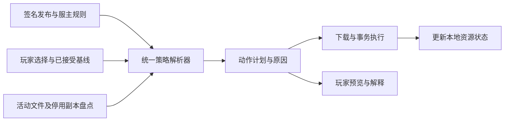

# 梦鱼更新系统文件维护策略重构草案

> 本文保留当时的设计或验证记录。0.3.0 已采用简化维护方案，当前行为见 [简化维护说明](../SIMPLE-MANAGEMENT.md)。

建议保留现有发布、下载和事务模块，围绕“资源身份、维护规则、历史处置”建立一个统一决策模型。服主界面继续提供简单预设，内部把预设编译成规则；新增维护需求通过组合规则表达，避免每次增加一种模式就修改所有分支。

这是根据现有代码审查和服主提出的新场景形成的整体重构草案。2026 年 10 月 2 日已修复 F1–F8，包括本地事务、预览绑定和静态签名载荷；统一资源模型与历史撤回尚未接入业务。现状见[修复记录](D:/Desktop/DreamingFish-Updater/docs/reviews/2026-10-02-priority-fixes.md)，原始证据见[架构审查](D:/Desktop/DreamingFish-Updater/docs/reviews/2026-10-01-architecture-review.md)。

## 首先解决已放弃管理的文件如何再次移除

服主应能在历史文件中选择“撤回”，填写问题原因，并发布新的完整目标状态。玩家端根据明确的内容匹配移出文件，保存可恢复归档，记录结果。撤回规则独立于文件是否还在普通托管清单中。

例如：

| 发布 | 服主操作 | 玩家应得到的结果 |
| --- | --- | --- |
| R1 | 发布 `mods/example.jar`，内容哈希为 H1 | 默认安装或同步 |
| R2 | 放弃管理并保留副本 | 当前副本成为玩家所有，不再日常覆盖 |
| R3 | 发现 H1 有严重问题，撤回 H1 | 活动目录和停用存储中匹配 H1 的副本进入撤回归档 |
| R4 | 只更新其他内容 | H1 的撤回规则仍然有效 |

从 R1 直接更新到 R4、从 R2 更新到 R4、第一次使用带 R1 签名基线的旧下载包，都必须处理 H1。不能要求玩家先经过 R2 或 R3。

如果玩家把同名文件替换成另一份内容 H2，不能仅根据路径就断定它是 H1。普通文件的默认撤回应跳过不匹配内容并报告；要求必须处理的撤回，则在不能确认时展示冲突并停止授予对应启动许可，由玩家选择归档该副本或提供已确认的替代内容。

对于模组，改名后的 H1 仍是同一份有问题的内容，应在受控模组范围中按内容识别。`modId` 可以用于说明和扩大候选范围，但不能单独充当内容证明；一个 JAR 也可能声明多个组件。

## 把混在模式里的问题拆开

当前“强制同步”同时表示不允许玩家豁免、校验文件内容，以及目录内未知文件需要移出。当前“放弃管理”又被当成删除时的一个选项。这些含义应分别表达。

| 决策维度 | 它回答什么 | 建议取值 |
| --- | --- | --- |
| 资源身份 | 这是哪个长期维护的模组、配置或资源包 | 项目内稳定资源标识；路径与版本是属性 |
| 内容维护方式 | 发布变化时怎样处理这项资源 | 跟随发布、只首次下发、未被修改时更新 |
| 玩家维护权限 | 玩家能否停用、取消托管或选择替代版本 | 按资源授权；必需资源有明确内容约束 |
| 目录边界 | 没有被发布的额外文件怎么办 | 保留、提醒、归档移出 |
| 生命周期处置 | 不再日常维护或出现严重问题怎么办 | 继续管理、交还玩家、退休移除、历史撤回 |

“删除”是执行动作，“放弃管理”是所有权变化，“强制”是内容或使用约束，“同步目录”是范围规则。它们不应成为一个不断扩展的总枚举。

内部不向服主展示全部组合；先提供常用、含义清楚的预设，并在发布预览中展示它们最终产生的规则。

## 建议的服主预设

| 预设 | 文件内容维护 | 玩家选择 | 额外文件 |
| --- | --- | --- | --- |
| 普通托管 | 默认跟随发布 | 可取消托管；模组可停用 | 保留 |
| 必需模组或关键配置 | 满足当前发布约束 | 对这项资源的豁免不能绕过约束 | 同目录其他内容保留 |
| 可选模组 | 选中后跟随发布 | 可选装、停用、再次启用 | 保留 |
| 首次配置 | 仅在从未初始化时下发 | 下发后玩家维护 | 保留 |
| 可更新默认配置 | 本地仍等于已下发基线时更新 | 本地有修改则保留并报告 | 保留 |
| 目录镜像 | 目录内发布内容跟随目标 | 受该范围约束 | 不符合范围允许项的文件归档移出 |

“可更新默认配置”利用已下发内容哈希判断是否还保持默认，不尝试合并任意 TOML、NBT、JSON 或模组私有格式。确需保留某些配置键时，应开发具有格式及语义知识的专门迁移器。

“只首次下发”与旧 `LEGACY_MISSING_ONLY` 不同：前者记录该资源已经初始化，玩家删除后不会在每次启动时重新生成；后者会在每次缺失时补齐。兼容旧协议时应保持原行为，不能直接改名映射。

文件级必需规则与目录镜像独立。例如可以要求核心模组与服主一致，同时允许玩家增加地图模组；只有明确选择镜像范围时才处理额外文件。

## 建议的内部模型

### 资源与文件位置

`ResourceSpec` 描述一个项目内稳定的资源：标识、当前内容哈希、大小、部署路径、组件元数据和维护规则。版本变化导致文件名改变时，可以继续指向同一资源身份。

稳定标识由管理端生成并维护，不能单靠文件名、模组名或不可信的组件声明重新推断。首次迁移普通文件可由项目与路径建立初始映射；之后改名需要显式关联，模组元数据只提供关联建议。

一份资源可能有多个本地副本或位置。玩家活动目录、停用存储区、已释放副本和归档都需要记录内容身份。停用应改变位置和玩家选择，而不是把它变成引擎看不见的文件。

### 可信目标与本地资源状态

`AcceptedRelease` 记录接受的签名目标、发布序号及信任信息。`LocalResourceState` 记录实际安装或持有的资源，包括当前归属、实际内容、当前位置、初始化基线和玩家选择。

两者必须分开。清单中声明一个文件，不等于玩家当前实际安装了它；停用时曾经托管，也不等于几年后仍由服主管理。

旧签名清单保留原始字节用于验签，再由协议适配器转换为内部模型。不能通过重新序列化内部模型来验证旧签名。

### 范围规则与历史处置

`ScopeRule` 描述目录中额外内容的处理方式。`RetirementDirective` 描述已退休资源是移除还是交还玩家。`WithdrawalDirective` 描述已经发布的特定内容需要被撤回。

历史处置是目标状态的一部分。退休或放弃管理的资源不必继续拥有可安装文件，但仍需要保留足够的信息，使任意旧基线都能直接得到正确处置。

第一步实现撤回时可以保持现有 `files`、`forcedSyncDirectories`、`forcedSyncFiles` 和 `releasedPaths`，只增加独立撤回字段；通过适配器先统一含义，不必同时替换全部公开协议。

## 一个决策入口



`EffectivePolicyResolver` 只计算规则，不做文件 I/O，也不保存 UI 状态。盘点服务提供文件事实；规划器结合决策和事实生成动作；执行器保证文件及记录一起提交或恢复。

每个决策携带原因、来源规则和匹配证据。例如：

```text
动作：归档并移出 mods/example.jar
原因：服主撤回了这个历史文件版本
证据：当前 SHA-256 与撤回规则中的 H1 相同
归档：玩家撤回归档目录
后续：停用列表不能把这个副本自动恢复到游戏
```

本地文件树、模组列表、启动检查和更新日志共用这个结果。UI 负责展示，不再分别重新计算“这是不是强制文件”。

## 规则组合与冲突

1. **先验证不可写边界。** 引导程序和玩家程序存储等受保护路径始终不能被普通发布或撤回规则操作。
2. **独立识别历史撤回。** 对匹配到的内容产生撤回动作，检查要求级别，再处理当前位置；不会因文件已释放或停用就消失。
3. **计算当前内容维护和玩家权限。** 单文件必需约束可以覆盖普通目录中的本地豁免；可选资源尊重玩家选择。
4. **处理退休与所有权转移。** 已释放资源默认保留；只有另外匹配的撤回规则才能要求后续移出。
5. **最后处理目录额外内容。** 根据有效范围规则归档未知文件，同时处理明确允许的例外。

同一维度中，精确资源规则优先于较宽范围规则；同等优先级的相互矛盾规则拒绝发布。不同维度分别组合，不能使用一个总的“最后匹配覆盖所有含义”。

例如“交还玩家的文件”落入新增镜像范围，或者必需目标内容恰好被有效撤回，不应默默删除旧声明来凑出清单。发布预览必须展示冲突，服主需要明确选择接管该资源、修改范围或撤销撤回。

规则校验与发布预览应使用同一个解析器。玩家本机额外文件的实际数量由本机盘点；服主预览展示范围、约束和已知历史内容的变化。

## 撤回规则的最低协议要求

以下是字段含义示例，尚不是当前协议可直接使用的 JSON：

```json
{
  "requiredCapabilities": ["file-withdrawal-v1"],
  "withdrawals": [
    {
      "id": "withdraw-example-version-1",
      "resourceId": "example-mod",
      "matchSha256": ["从项目历史发布中选择的完整 SHA-256"],
      "scope": "mods",
      "requirement": "required",
      "action": "archive",
      "reason": "这个版本会造成严重问题"
    }
  ]
}
```

必须满足以下条件：

- 由项目签名，不允许服主规则指定实例外的任意路径。
- 来自历史发布的匹配内容可追溯；默认用内容哈希识别，路径和组件是候选定位信息。
- 活动规则出现在此后每个完整目标中。不能按“发布后七天”自动清除，因为旧下载包和长期离线玩家仍可能存在。
- 不支持该能力的玩家端必须先升级；无法升级时明确失败，不能忽略撤回后继续声明验证成功。
- 停用存储、重新启用和归档恢复也经过同一规则判断。恢复一份仍被撤回的内容必须显示规则冲突。
- 执行动作可重复验证。记录某个撤回曾执行过，不代表以后可以忽略重新出现的相同问题内容。
- 取消撤回必须是服主明确的新发布操作；普通内容回滚默认继承当前有效撤回。

要求级别建议先区分“建议处理”和“必须处理”。前者报告并尊重明确的玩家拒绝；后者对匹配文件执行已授权的归档移出，对身份不明或操作失败的副本给出冲突并停止本次必要验证。每种结果必须在 UI 与日志中说明，不能统称“更新完成”。

严重问题若涉及服务器准入，准入仍由目标服务器负责。这里定义的是更新器正常工作流程中的处置要求，不能把玩家自己可修改的本地程序当成反作弊边界。

## 事务应覆盖文件与记录

建议让事务计划覆盖安装、替换、归档、活动与停用位置间移动，以及资源状态和偏好的更新。所有文件变更记录操作前的状态、预期内容和恢复所需位置。

执行前复核盘点条件；文件在规划后变化时重新规划或给出冲突，不能无条件继续覆盖。事务提交后才公布新的已接受目标与本地资源状态；失败或崩溃时恢复文件和记录。

撤回产生的归档应与事务临时备份分开。前者供玩家查看和恢复，不自动清理；后者只服务失败回滚，成功提交后可以清理。文件的归档位置需要随执行结果记录，不能只存在于 UI 的提示文字里。

本地状态与事务格式必须有版本。新玩家端迁移状态之前，要验证旧事务的恢复，以及程序失败回退时的兼容边界；不能承诺旧程序能理解新增的操作类型或状态格式。

## 管理端和玩家端的操作

管理端的发布预览建议分为内容变化、维护规则变化、历史处置变化。它们共同组成一份待确认目标，提交时绑定预览标识、摘要和项目修订号。

服主删除标准目录里的托管文件时，仍提供“移除玩家副本”和“交还玩家”两个明确操作。对于已经交还玩家的文件，历史文件页面另有“撤回这个历史版本”。不需要重新上传问题文件来把它临时变回托管状态。

玩家端每个模组或文件展示当前内容归属、允许的本地选择和有效限制。停用模组仍是可盘点资源。发生撤回时展示原因、匹配版本、处理结果和归档位置；文件身份不明时展示具体冲突。

普通托管下“重新启用”必须根据当前资源状态恢复玩家副本或安装当前官方内容；已经交还玩家的副本不得作为旧官方缓存清理。规则在一个地方解释，界面与实际执行使用同一结果。

## 分阶段落地

### 第一阶段 修正已有文件保留与恢复行为

该阶段的 F1–F5 已完成；F6–F8 也已独立修复。后续阶段仍是设计方案。

把审查探针转为正式回归测试，先修复路径越界、已释放停用副本清理、回滚释放记录丢失、备份回退清理和本地启停部分提交。现有正常行为维持协议兼容。

### 第二阶段 为现有协议增加历史撤回

通过能力字段和明确的最低玩家版本引入撤回。管理端允许从历史发布选择内容，玩家引擎盘点活动及停用副本，并在事务中归档处理。此阶段必须完成服主新场景的全链路验收。

### 第三阶段 将现有规则映射到统一内部模型

将普通托管、精确强制、目录镜像、本地豁免、释放路径逐一映射；对相同输入比较旧规划器与新规划器结果。差异只有在修复已明确的问题时才能接受。稳定后让各调用者共用解析器。

### 第四阶段 引入真实本地资源状态

迁移 `managedAtDisable` 等历史布尔标记。对于只能证明“曾托管”、无法确认当前所有权或副本来源的旧记录，保留副本并报告，不直接推断可删。资源状态与文件变化共同提交。

### 第五阶段 添加预设与整理界面

根据实际需求增加首次配置、可更新默认配置、可选组件等预设。拆分管理 API、玩家控制器和 UI store，并定义侧车消息的版本与契约检查。随后再评估把哪部分实现迁移到 Rust。

## 关键验收场景

| 场景 | 必须成立的结果 |
| --- | --- |
| 普通托管文件更新 | 未豁免者跟随发布 |
| 玩家豁免普通托管文件 | 保留玩家副本 |
| 精确必需文件位于豁免目录 | 该文件满足约束，同目录其他文件遵循各自规则 |
| 普通目录中的自选模组 | 保留并正常列出 |
| 镜像目录中的额外模组 | 归档移出，失败可恢复 |
| 托管模组更新时改名 | 同一资源的玩家选择持续有效 |
| 玩家停用模组期间服主释放它 | 副本归玩家，重新启用可恢复 |
| 已释放文件后来被撤回 | 活动副本与停用副本均被识别 |
| 从任意旧版本直接跳到最新 | 不漏掉释放、退休或撤回 |
| 玩家给问题文件改名 | 在声明范围内仍按内容识别 |
| 同名文件由玩家换成不同内容 | 不作为旧内容直接删除；按要求级别报告或阻断冲突 |
| 撤回后玩家再次复制回问题内容 | 下一次检查仍识别规则 |
| 回滚到释放前的内容版本 | 只有明确接管的资源改变归属 |
| 回滚到含有已撤回内容的版本 | 发布时报告冲突，不自动取消撤回 |
| 玩家删除已经首次下发的配置 | 不自动重新初始化 |
| 默认配置有玩家修改 | 更新保留修改并报告 |
| 文件移动中途失败或崩溃 | 文件和索引共同恢复 |
| 验证后文件被外部修改 | 提交前发现条件变化 |
| 新格式状态遇到旧程序回退 | 正确兼容或明确失败，不能误授许可 |
| 预览后规则或删除决定变化 | 旧发布确认失效 |
| 静态托管切换到新目标 | 载荷和签名来自同一个不可变对象 |
| 下载响应体停滞并取消 | 工作线程与流及时结束，重试不会并发写旧暂存文件 |

这份草案优先采用可追溯内容匹配、可恢复归档、集中决策和渐进迁移。可选组件依赖解析、允许替代版本的范围以及特定配置迁移器仍需要根据具体整合包需求细化，不应在第一阶段一起扩张。
